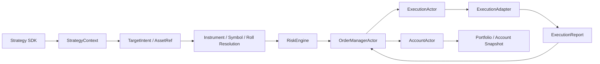

# Backtest / Paper / Live Parity

## Goal

Backtest, paper, and live are execution modes of the same trading system.
They must share core domain rules, resolver boundaries, actor flow, order state
ownership, risk checks, and account mutation semantics.

Only external boundaries may differ: data source, broker adapter, clock, latency,
credentials, connectivity, persistence, and external broker capabilities.

## Shared Core Flow

## Mode-Specific Boundaries

`historical`/`realtime` and `backtest`/`paper`/`live` are separate concepts.
The first axis describes the market data source's temporal delivery model. The
second axis describes the execution mode and adapter set. Backtests normally
consume historical replay, but historical market data configuration belongs to
the data source boundary, not to the backtest mode boundary.

| Concern | Shared Core | Backtest | Paper | Live |
| --- | --- | --- | --- | --- |
| Strategy API | `Strategy`, `StrategyContext`, `TargetIntent` | same | same | same |
| Symbol identity | `InstrumentId`, `InstrumentRegistry` | same | same | same |
| Roll resolution | `FutureRollRegistry` or compatible contract | historical-derived selections | adapter/precomputed selections | live/precomputed selections |
| Risk | `RiskEngine` + rules | same | same | same |
| Order lifecycle | `OrderManagerActor` | same | same | same |
| Execution actor | `ExecutionActor` | same | same | same |
| Execution adapter | `ExecutionAdapter` protocol | simulated/backtest adapter | paper broker adapter | live broker adapter |
| Account mutation | `AccountActor` only | same | same | same |
| Market data | logical subscriptions, physical source subscriptions, `Bar`/`Tick`/`Quote`, aggregation, fan-out | historical/replay source | paper source | live source |
| Clock | runtime time source | replay clock | paper clock | live clock |

## Required Invariants

- Strategy code emits intents only; it must not create orders directly.
- Risk checks must run before order submission in every mode.
- Order state is owned by `OrderManagerActor` in every mode.
- Account cash and positions are owned by `AccountActor` in every mode.
- Broker/data-source symbols stay at adapter boundaries.
- Core runtime uses `InstrumentId`, never broker symbols.
- Strategy-requested market data timeframes are logical subscriptions.
- Provider-supported source timeframes are physical subscription capabilities and must not redefine strategy-facing bar semantics.
- Market data aggregation and fan-out semantics are shared across backtest, paper, and live modes.
- Continuous futures are not directly tradable.
- Continuous futures must resolve to concrete contracts before order creation.
- Backtest cannot use a shortcut path that live cannot use.
- Live cannot implement business behavior that cannot be exercised in backtest.

## Allowed Divergence

Divergence is allowed only at these adapter boundaries:

- Market data source.
- Broker execution adapter.
- Clock and scheduling source.
- Latency/fill simulation model.
- Broker connectivity and credentials.
- External broker capability handling.
- Persistence backend, when the domain contract is unchanged.

Every divergence must name the boundary and explain why it is external I/O or
environment-specific.

## Fill-Timing Policy Defaults

`ExecutionTimingModel` (owned by `qts.domain.execution_timing`, a lower shared
layer so runtime/config never imports the backtest layer) selects the fill
policy at the execution boundary (`same_bar_close` vs `next_bar_open`). The
default is **uniformly the honest policy**, with optimistic fills opt-in,
gated, and never promotion-grade (QTS-FINAL-004):

- **`next_bar_open` is the default everywhere.** `ExecutionTimingModel()`,
  `BacktestRuntimeConfig` / `config_loader`, the autonomous research engine
  (`AutonomousResearchEngine`), and the campaign config
  (`CampaignExecutionConfig`) all default to `next_bar_open` — a decision at the
  close of completed bar `N` fills at `N+1`'s open, the next obtainable price.
- **`same_bar_close` is optimistic look-ahead and opt-in only.** Selecting it
  requires an explicit `optimistic_fill_waiver=True` (rejected at config /
  model construction otherwise). The decision bar's close is not realistically
  obtainable while the bar is still forming, so the waiver records an informed
  research decision to accept the look-ahead — it does not make the run
  honest.
- **`same_bar_close` is never promotion-grade.** Fill timing is part of every
  run's hash identity (`fill_policy` + `optimistic_fill_waiver` are always in
  `BacktestRuntimeConfig.to_payload()`, and the manifest always records
  `execution_timing.promotion_grade` / `optimistic`). `is_promotion_grade` is
  `True` only for `next_bar_open`; `PromotionPacketV2.validate_machine()` rejects
  any evidence whose manifest reports `fill_timing_promotion_grade=False`, so a
  `same_bar_close` packet is rejected regardless of any waiver.

Covered by `tests/anchor/test_backtest_default_fill_policy_next_bar_open.py`,
`tests/integration/test_backtest_next_obtainable_fill_policy.py`,
`tests/unit/backtest/test_backtest_execution_timing_config.py`,
`tests/unit/research/test_same_bar_close_never_promotion_grade.py`,
`tests/replay/test_fill_policy_part_of_report_hash.py`, and
`tests/integration/research/test_autonomous_rejects_same_bar_close_promotion.py`.

## Margin Enforcement

Futures initial-margin enforcement is a per-contract product fact owned by
`ContractSpec.initial_margin_rate`. `BacktestEngine.from_config` builds the
`RiskEngine` through `RiskRuleRegistry` and appends `MarginRule` + a
`MarginCalculator` when a margin rate is resolvable from the instrument
registry. Tradable futures are fail-closed: if a futures instrument reaches
risk without `initial_margin_rate`, the run is rejected before orders can
bypass margin enforcement.

The catalog/replay data path populates `initial_margin_rate` from futures-chain
metadata through `ReplayMarketDataBundleBuilder`, and backtest manifests record
both `contract_economics_hash` and `margin_policy_hash` so the economics used
by replay/risk are auditable. This is covered by
`tests/integration/test_catalog_futures_margin_enforced.py`,
`tests/integration/test_runtime_futures_margin_enforced.py`, and
`tests/unit/data/test_replay_market_data_source.py`.

## Forbidden Patterns

- Calling broker adapters directly from strategy code.
- Mutating account state outside `AccountActor`.
- Creating fills outside normalized `ExecutionReport` handling.
- Having a `BacktestOrderManager` with different lifecycle semantics.
- Having live-only risk logic that backtest skips.
- Creating a backtest-only or live-only market data aggregation path.
- Letting provider bar limitations change requested timeframe semantics.
- Resolving futures roll in `qts.data.historical` only.
- Passing broker symbols through portfolio, risk, order, or strategy internals.
- Using concrete historical fixtures to hardcode product behavior.

## Review Checklist

A PR touching backtest, paper, live, market data, order flow, or symbol resolution
must answer:

- Does this reuse the shared Strategy SDK -> Risk -> OrderManagerActor ->
  ExecutionActor -> AccountActor path?
- If not, is the difference strictly at an adapter boundary?
- Does every external symbol become InstrumentId before entering core logic?
- Do logical market data subscriptions map to deduplicated physical source subscriptions?
- Are requested bars produced through shared aggregation semantics rather than provider-specific shortcuts?
- Are continuous futures resolved to concrete contracts before order creation?
- Are risk and order-state transitions covered by tests?
- Is there an integration or anchor test protecting parity?

## Required Tests

Anchor tests protect domain invariants:

- Continuous futures are not directly tradable.
- Continuous futures resolve to concrete contracts before order creation.
- Risk cannot be bypassed.
- Account state only changes from validated fills.
- Provider source timeframe capability cannot redefine requested bar semantics.

Integration tests protect flow parity:

- Backtest order flow goes through `RiskEngine`, `OrderManagerActor`,
  `ExecutionActor`, and `AccountActor`.
- Paper/live adapter tests use the same message contracts.
- Historical and live market data sources use the same actor-facing subscription and event contracts.
- Futures roll changes concrete contracts without changing strategy API.
