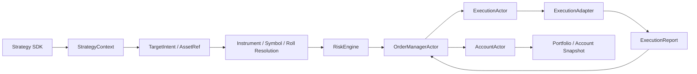

# Backtest / Paper / Live Parity

## Goal

Backtest, paper, and live are execution modes of the same trading system.
They must share core domain rules, resolver boundaries, actor flow, order state
ownership, risk checks, and account mutation semantics.

Only external boundaries may differ: data source, broker adapter, clock, latency,
credentials, connectivity, persistence, and external broker capabilities.

## Shared Core Flow

## Mode-Specific Boundaries

`historical`/`realtime` and `backtest`/`paper`/`live` are separate concepts.
The first axis describes the market data source's temporal delivery model. The
second axis describes the execution mode and adapter set. Backtests normally
consume historical replay, but historical market data configuration belongs to
the data source boundary, not to the backtest mode boundary.

| Concern | Shared Core | Backtest | Paper | Live |
| --- | --- | --- | --- | --- |
| Strategy API | `Strategy`, `StrategyContext`, `TargetIntent` | same | same | same |
| Symbol identity | `InstrumentId`, `InstrumentRegistry` | same | same | same |
| Roll resolution | `FutureRollRegistry` or compatible contract | historical-derived selections | adapter/precomputed selections | live/precomputed selections |
| Risk | `RiskEngine` + rules | same | same | same |
| Order lifecycle | `OrderManagerActor` | same | same | same |
| Execution actor | `ExecutionActor` | same | same | same |
| Execution adapter | `ExecutionAdapter` protocol | simulated/backtest adapter | paper broker adapter | live broker adapter |
| Account mutation | `AccountActor` only | same | same | same |
| Market data | logical subscriptions, physical source subscriptions, `Bar`/`Tick`/`Quote`, aggregation, fan-out | historical/replay source | paper source | live source |
| Clock | runtime time source | replay clock | paper clock | live clock |

## Required Invariants

- Strategy code emits intents only; it must not create orders directly.
- Risk checks must run before order submission in every mode.
- Order state is owned by `OrderManagerActor` in every mode.
- Account cash and positions are owned by `AccountActor` in every mode.
- Broker/data-source symbols stay at adapter boundaries.
- Core runtime uses `InstrumentId`, never broker symbols.
- Strategy-requested market data timeframes are logical subscriptions.
- Provider-supported source timeframes are physical subscription capabilities and must not redefine strategy-facing bar semantics.
- Market data aggregation and fan-out semantics are shared across backtest, paper, and live modes.
- Continuous futures are not directly tradable.
- Continuous futures must resolve to concrete contracts before order creation.
- Backtest cannot use a shortcut path that live cannot use.
- Live cannot implement business behavior that cannot be exercised in backtest.

## Allowed Divergence

Divergence is allowed only at these adapter boundaries:

- Market data source.
- Broker execution adapter.
- Clock and scheduling source.
- Latency/fill simulation model.
- Broker connectivity and credentials.
- External broker capability handling.
- Persistence backend, when the domain contract is unchanged.

Every divergence must name the boundary and explain why it is external I/O or
environment-specific.

## Fill-Timing Policy Defaults

`ExecutionTimingModel` selects the fill policy at the execution-adapter boundary
(`same_bar_close` vs `next_bar_open`). Default selection is deliberately split by
entrypoint and gated for honesty:

- **Promotion-feeding entrypoints default to the honest policy.** The autonomous
  research engine (`AutonomousResearchEngine`) and campaign config
  (`CampaignExecutionConfig`) default `fill_policy = next_bar_open`
  (promotion-grade: a decision at bar `N` fills at `N+1` open).
- **The generic single-run primitive stays backward-compatible.**
  `BacktestRuntimeConfig` / `config_loader` keep `same_bar_close` as the
  construction default so existing ad-hoc/in-sample example configs and their
  recorded outputs are unchanged. `same_bar_close` is optimistic (the decision
  bar's close is not realistically obtainable) and is always an explicit,
  identity-bearing choice once overridden.
- **Honesty is enforced at the promotion gate, not by silent default flipping.**
  The backtest manifest records `execution_timing.promotion_grade` /
  `optimistic`; `PromotionPacketV2.validate_machine()` rejects evidence produced
  with `same_bar_close` unless an explicit optimistic waiver is recorded, and a
  waived packet is permanently stamped `optimistic`.

Deliberate deviation from the original deep-review plan (which asked the generic
config default to also be `next_bar_open`): flipping the generic primitive would
change the numerical results of all existing `configs/backtest.*.yaml` runs for
no promotion-honesty benefit (those runs cannot be promoted, and the
research/promotion paths already default honest). The correctness intent —
"production/promotion entrypoints never silently use optimistic fills" — is met
by the honest research defaults plus the promotion gate. Covered by
`tests/integration/test_backtest_next_obtainable_fill_policy.py`,
`tests/unit/backtest/test_backtest_execution_timing_config.py`, and
`tests/integration/research/test_autonomous_rejects_same_bar_close_promotion.py`.

## Margin Enforcement

Futures initial-margin enforcement is a per-contract product fact owned by
`ContractSpec.initial_margin_rate`. `BacktestEngine.from_config` builds the
`RiskEngine` through `RiskRuleRegistry` and appends `MarginRule` + a
`MarginCalculator` only when a margin rate is resolvable from the instrument
registry — rate-less runs behave exactly as before (no fail-closed rejection).

Deferred: the catalog/replay data path
(`qts.data ... replay_bundle_builder`) does not yet populate
`initial_margin_rate` from the futures-chain config, so catalog-loaded
production backtests leave the rate `None` and do not enforce margin until a
chain-config margin knob is added. The config-driven path is fully wired and
exercised end-to-end by `tests/integration/test_runtime_futures_margin_enforced.py`.
This is an isolated data-source-layer follow-up; it does not weaken the
config-driven gate.

## Forbidden Patterns

- Calling broker adapters directly from strategy code.
- Mutating account state outside `AccountActor`.
- Creating fills outside normalized `ExecutionReport` handling.
- Having a `BacktestOrderManager` with different lifecycle semantics.
- Having live-only risk logic that backtest skips.
- Creating a backtest-only or live-only market data aggregation path.
- Letting provider bar limitations change requested timeframe semantics.
- Resolving futures roll in `qts.data.historical` only.
- Passing broker symbols through portfolio, risk, order, or strategy internals.
- Using concrete historical fixtures to hardcode product behavior.

## Review Checklist

A PR touching backtest, paper, live, market data, order flow, or symbol resolution
must answer:

- Does this reuse the shared Strategy SDK -> Risk -> OrderManagerActor ->
  ExecutionActor -> AccountActor path?
- If not, is the difference strictly at an adapter boundary?
- Does every external symbol become InstrumentId before entering core logic?
- Do logical market data subscriptions map to deduplicated physical source subscriptions?
- Are requested bars produced through shared aggregation semantics rather than provider-specific shortcuts?
- Are continuous futures resolved to concrete contracts before order creation?
- Are risk and order-state transitions covered by tests?
- Is there an integration or anchor test protecting parity?

## Required Tests

Anchor tests protect domain invariants:

- Continuous futures are not directly tradable.
- Continuous futures resolve to concrete contracts before order creation.
- Risk cannot be bypassed.
- Account state only changes from validated fills.
- Provider source timeframe capability cannot redefine requested bar semantics.

Integration tests protect flow parity:

- Backtest order flow goes through `RiskEngine`, `OrderManagerActor`,
  `ExecutionActor`, and `AccountActor`.
- Paper/live adapter tests use the same message contracts.
- Historical and live market data sources use the same actor-facing subscription and event contracts.
- Futures roll changes concrete contracts without changing strategy API.
